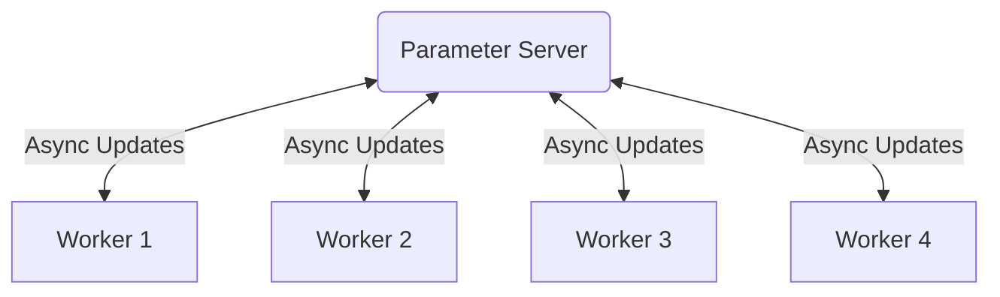
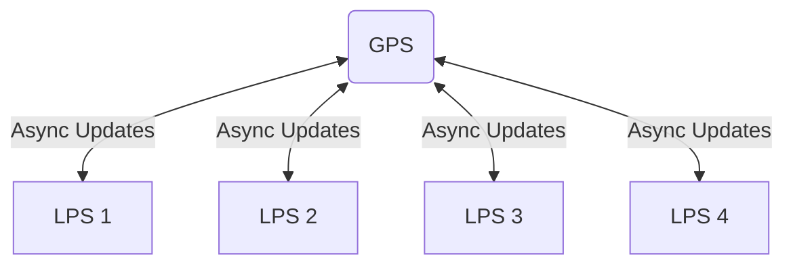

+++
title = "DiLoCo Research Questions"
date = 2025-10-14T10:54:27-05:00
tags = ["Machine Learning"]
+++


> Originally, I was doing my master's thesis around distributed low-communication training. I eventually changed my focus to a different area, but these are some of the notes I wrote about the original topic.


## DiLoCo and Local SGD Overview
It is October 15th, 2025. For my last year of my master's, I decided to a thesis around distributed low-communication training. Essentially, how can we train large models efficiently across distributed nodes and not be utterly destroyed by network latency and bandwidth?

The main approach currently is Local SGD, where we have $M$ distributed workers (which consist of one or more nodes) that each take $H$ local optimization steps. After each worker finishes their $H$ steps, we take the average of the distance of each worker's ending parameter state from their starting parameter state to get what we call an *outer-gradient* or a *pseudo-gradient*. We update the original weights with the outer-gradient using an outer-optimizer.

Below is the algorithm in pseudo-code.

``` python
# Require: Initial model 𝜃(0)
# Require: k workers
# Require: Data shards {D1,...,Dk}
# Require: Optimizers InnerOpt and OuterOpt
for outer_step t = 1...T:
    for worker i = 1...k: # In parallel
        𝜃_i(t) = 𝜃(t−1)
        for inner_step h = 1...H:
            x = get_batch(D_i)
            loss = f(x, 𝜃_i(t))
            𝜃_i(t) = InnerOpt(𝜃_i(t), ∇loss) # Inner optimization

    # Averaging outer gradients
    Δ(t) = (1/k) * sum([𝜃(t−1) - 𝜃_i(t) for 𝜃_i(t) in workers.params])
    𝜃(t)  = OuterOpt(𝜃(t-1), Δ(t)) # Outer optimization
```

This general algorithm is called Local SGD, but it sometimes is referred to as DiLoCo, especially when training LLMs in distributed data center settings. From now on I'll refer to it as DiLoCo I'm focusing on this setting specifically.

Some core papers about DiLoCo are:
- [DiLoCo: Distributed Low-Communication Training of Language Models](https://arxiv.org/abs/2311.08105)
- [Communication-Efficient Learning of Deep Networks from Decentralized Data](https://arxiv.org/abs/1602.05629)

Some relevant papers building upon DiLoCo to improve and scale it are:
- [OpenDiLoCo: An Open-Source Framework for Globally Distributed Low-Communication Training](https://arxiv.org/abs/2407.07852)
- [Overlap Local-SGD: An Algorithmic Approach to Hide Communication Delays in Distributed SGD](https://arxiv.org/abs/2002.09539)
- [Asynchronous Local-SGD Training for Language Modeling](https://arxiv.org/abs/2401.09135)
- [HALoS: Hierarchical Asynchronous Local SGD over Slow Networks for Geo-Distributed Large Language Model Training](https://arxiv.org/abs/2506.04531)
- [Streaming DiLoCo with overlapping communication: Towards a Distributed Free Lunch](https://arxiv.org/abs/2501.18512)
- [Eager Updates For Overlapped Communication and Computation in DiLoCo](https://arxiv.org/abs/2502.12996)
- [DiLoCoX: A Low-Communication Large-Scale Training Framework for Decentralized Cluster](https://arxiv.org/abs/2506.21263)

### Research Directions

There are many potential research directions I've thought of. The easiest to test and most useful is:

1. Study the impact of heterogeneous workers.

The Async Local SGD paper (referred to as Async DiLoCo by the [author](https://arthurdouillard.com/research/)) tested giving each workers a different number of inner steps to process based on relative processing speed. If worker 1 has $H_1=100$ and worker 2 is half as fast, we give them half as many steps ($H_2=50$) so that they both finish around the same time.

This idea is very simple and makes sense, but it is completely non-trivial on how this impact convergence. The best comparison is, imagine we are doing Distributed Data Parallel training (DDP), but each worker has a different weight when averaging? In both cases, the magnitudes of the gradient (and pseudo-gradient) we are averaging over are different between each worker. This seems like it fundamentally changes training behavior.

From empirical experiments, it seems like models are generally robust to it, but a rigorous study over this would be useful, especially if we are choosing to dynamically change worker inner steps during training.

2. See if parameter drift is the main explanation of convergence degradation.

Each variant of DiLoCo which tries to mask communication cost suffers some kind of staleness as a result. Each variant is different but parameter drift, the distance from the parameter state of where a gradient was applied to the parameter state where it was originally calculated, might be a good general way to describe staleness.

Each of these variants suffer from a different amount of decreased convergence performance, and I have a hunch that parameter drift might be an important metric correlated with this.

I have more ideas, but these are two good ones I will start investigating.


## HALoS and Async DiLoCo

I've spent much of today reading the [source code](https://github.com/utnslab/halos) of [HALoS](https://icml.cc/virtual/2025/poster/45594). The main idea of the paper is right in the title, "HALoS: Hierarchical Asynchronous Local SGD over Slow Networks for Geo-Distributed Large Language Model Training".

One problem with current DiLoCo variants is that they assume each worker has the same network latency as each other. In reality, inter-region communication might be drastically worse than intra-region communication. Two workers located in the same state will have much higher bandwidth and lower latency than two workers located on different continents, sometimes up to several orders of magnitudes.

For standard [DiLoCo](https://arxiv.org/abs/2311.08105) (and [Streaming DiLoCo](https://arxiv.org/abs/2501.18512)), that means that we suffer from the straggler effect because of network limitations, where the outer-parameter synchronization is bottlenecked by the worker with the worst bandwidth and latency.

For variants that mask communication with computation, it leads to either:
- A higher required number of inner step to fully mask the communication (in the case of One-Step-Delay DiLoCo and variants like [Eager Update DiLoCo](https://arxiv.org/abs/2502.12996)) which negatively impacts convergence.
- A higher number of steps taken while waiting for the updated parameters (in the case of [Overlap Local-SGD](https://arxiv.org/abs/2002.09539)) before model merging, which is undesirable due to more compute being used on advancing stale parameters.

To first understand HALoS, we need to first understand [Async Local-SGD](https://arxiv.org/abs/2401.09135) (also known as Async DiLoCo). Essentially, instead of each worker synchronizing every $H$ steps, instead when they finish, they independently push their updates to a parameter server without waiting on others.



While this means we don't suffer synchronization costs, we now suffer from staleness because we are applying each worker's outer-update step individually and synchronously instead of taking one step using the average. This makes parameter drift (gradients being applied when the loss landscape has changed) which can lead to convergence issues.

HALoS doesn't directly address the staleness issue. Instead, it focuses on minimizing computation idle time. HALoS introduces *Local Parameter Servers (LPS)* within each region and a *global parameter server (GPS)* which merges updates across regions. One way to think about it is that we are running multiple instances of Async Local-SGD, each having multiple workers within the same region. We treat each LPS as a worker in Async Local-SGD and have another parameter server (the GPS) which they send updates to.



At this layer though, when a LPS communicates with the GPS, because of the lower bandwidth and increased latency, the LPS continues to apply updates from its workers. When it receives the updated parameters from the GPS, it merges it with its updated local parameters instead of replacing them.

Empirically, their evaluation shows that HALoS achieves up to $7.5\times$ convergence than standard DiLoCo and up to $2.1\times$ faster convergence than Async Local-SGD in geo-distributed environments.

### Simulator

The main thing of importance to me here is that their open-source simulator currently supports DiLoCo, Async Local-SGD, and HALoS. It would not be hard to add support for Overlap Local-SGD or One-step-delay DiLoCo and Eager Update DiLoCo (although Streaming DiLoCo would require a major rewrite).

I'll read the source-code and run it for my own experiments with heterogeneous workers, and then modify it for my experiments with parameter drift.


## Current Work on Heterogeneous Workers

A desirable problem to solve is being able to use different kinds of hardware for training. Even within the same generation, NVIDIA B300 GPUs are 50% faster than B200s. Companies like Meta have many homogeneous clusters that differ in hardware. It would be ideal to be able to train a model across clusters regardless of the exact underlying hardware used.

The two main recent works I've found on heterogeneous workers is [HALoS](https://icml.cc/virtual/2025/poster/45594) and [Async Local-SGD](https://arxiv.org/abs/2401.09135). The former uses a wide variety of worker speeds in their experiments, but there is no ablation study showing how differing worker speeds specifically impact convergence, so we will mainly focus on the latter. There are perhaps other important works that studied this, but I am unaware of them.

Both of these papers introduce a method where they scale the number of inner steps taken by a worker to their relative speed. For instance, if worker 1 has $H=100$ inner steps, if worker 2 is half as fast, worker 2 would take $H=50$ inner steps.

In Async DiLoCo, they have an ablation study which looks at how varying worker speeds affect the perplexity of their algorithm. For the first 3 algorithms just take more wall-clock time because each suffers from the straggler effect (but training is the exact same). The naive Async DiLoCo implementation (same number of worker steps) and the improved version (better optimizer + scaled worker steps to match speed) both seem to also not be impacted by heterogeneous worker speed.

Level of heterogeneity | no | slight | moderate | very
--- | --- | --- | --- | ---
Pretrained (24K) | 61.64 | 61.64 | 61.64 | 61.64 
Finetune (4× batch size) | 42.47 | 42.47 | 42.47 | 42.47 
DiLoCo (Douillard et al., 2023) | 41.35 | 41.35 | 41.35 | 41.35 
--- | --- | --- | --- | ---
Async. DiLoCo | 44.27 | 44.38 | 44.29 | 44.27 
Async. DN + DyLU (ours) | **41.27** | **41.27** | **41.09** | **41.13**

I found this very strange. In the naive Async DiLoCo implementation, a worker that is twice as slow will apply outer-gradients that are twice as stale, since each worker takes the same number of inner steps. In an earlier part of the paper, they found that just the inherent staleness, which comes from applying individual worker updates sequentially instead of averaging them and applying it once, lead to "considerable performance drops." So I would have imagined that significantly increasing staleness for certain workers would have *some* impact on convergence.

In the better version with the new Delayed Nesterov optimizer and Dynamic Local Updates (scaling inner steps $H$ to match worker speed), I would have still imagined some impact on convergence due to a different set of reasons.
Because outer-gradients (really parameter differences) have similar behavior to normal gradient, let's think about the normal DDP training setting where we synchronize at every step. Having a different inner step per worker in Async Local-SGD is analogous to having a different weight per worker when averaging in the DDP case. This seems like it would fundamentally impact training behavior.
